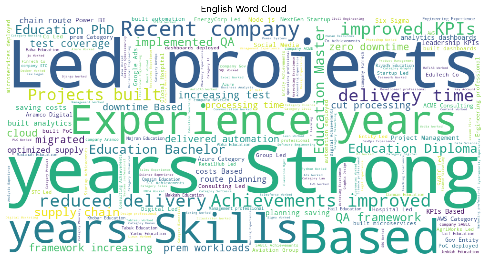
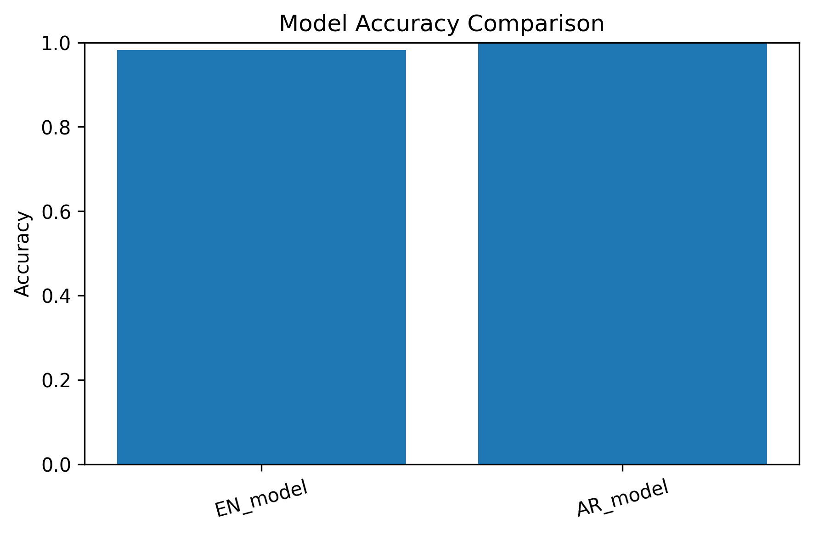

# 🧠 Multilingual Resume Classification (English + Arabic) using LLMs  


---

## 📌 Introduction  
This project, **Multilingual Resume Classification using Large Language Models (LLMs)**, focuses on automatically classifying resumes (CVs) into professional job categories.  
The main motivation is twofold:  
1. The need for automation in HR systems to process thousands of resumes efficiently.  
2. The challenge of handling multilingual resumes in both English and Arabic.  

The dataset consists of:  
- English CV dataset (~6800 samples)  
- Arabic CV dataset (~6800 samples)  

Both datasets were cleaned, normalized, and preprocessed before modeling.  

---

## 🚀 Features  
- Supports English & Arabic resumes.  
- Fine-tuned DistilBERT (English) & AraBERT-mini (Arabic).  
- Interactive Streamlit app for real-time classification.  
- Handles PDF, DOCX, and TXT uploads.  
- WordCloud visualizations with full Arabic support (reshaping & bidi).  
- Fully documented training pipeline (Jupyter Notebook).  

---

## ⚙️ Installation & Usage  

### Clone the repository  
```bash
git clone https://github.com/reemabal97/Resume-Classifier.git
cd Resume-Classifier
```

### Install dependencies  
```bash
pip install -r requirements.txt
```

### Run the Streamlit app  
```bash
streamlit run app.py
```
Then open: [http://localhost:8501](http://localhost:8501)  

### Train models (optional)  
The training pipeline is available in:  
- `Resume Classifier Training.ipynb`  

---

## 📂 Project Structure  
```plaintext
.
├── app.py                        # Streamlit app (English + Arabic)
├── Resume Classifier Training.ipynb  # Training & evaluation pipeline
├── requirements.txt              # Dependencies
├── plots/                        # Visualization images
├── README.md                     # Project documentation
```

---

## 📊 Example Outputs  

### 1. Class Distribution (Bar Plot)  
Shows the imbalance across categories in the dataset.  
  

### 2. Most Frequent Words (WordCloud)  
- English resumes  
  
- Arabic resumes  
  

### 3. Model Performance (Accuracy Comparison)  
Comparison of DistilBERT, AraBERT, and baseline models.  
  

### 4. Confusion Matrix (Evaluation)  
- English model  
  
- Arabic model  
  

---

## ✅ Results & Conclusion  
This project successfully built LLM-based systems for multilingual resume classification.  

- The English DistilBERT model achieved strong accuracy on the evaluation set.  
- The Arabic AraBERT-mini model performed effectively with smaller datasets when combined with preprocessing.  
- WordCloud visualizations were generated for both languages, ensuring correct Arabic rendering.  

### Key findings:  
- Transfer learning (DistilBERT, AraBERT) outperforms traditional ML baselines.  
- Preprocessing (reshaping, bidi, font embedding) is essential for Arabic NLP.  
- Streamlit deployment makes the system interactive and easy to extend.  

### Future extensions:  
- Expanding with a larger, more diverse dataset.  
- Enhancing performance with data augmentation and hyperparameter tuning.  
- Deploying as a cloud-based web service for HR automation.  

---

## 🙏 Acknowledgments (Optional)  
This project was developed as part of the **AI Practitioner Diploma – NITA (2025)**, with guidance from **Aramco Digital** mentors and instructors.  

---
